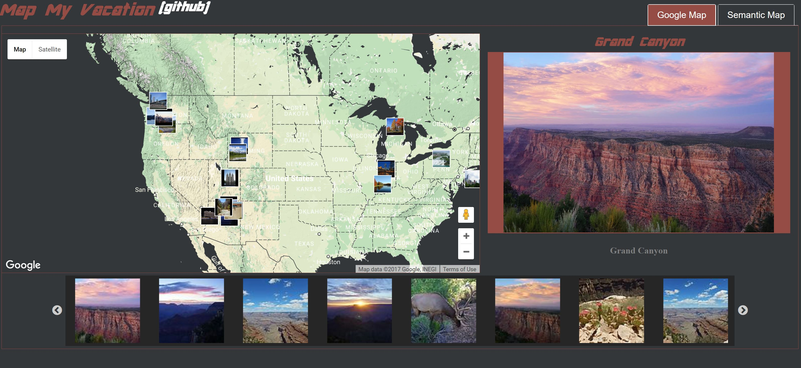

# Map My Vacation
Static Web Application and Python scripts for visualizing vacation photos on Geographic and Latent Semantic Maps.
<a href="https://nate-russell.github.io/MapMyVacation/"><a/>
Github Pages [Demo](https://nate-russell.github.io/MapMyVacation/)

## Ingredients
1. [Tensorflow](https://www.tensorflow.org/)
2. [D3.js](https://d3js.org/)
3. [Google Maps Javascript API](https://developers.google.com/maps/documentation/javascript/)
4. [Imgur's Python API](https://apidocs.imgur.com/)
5. [Slick](http://kenwheeler.github.io/slick/)
5. [Jquery UI](https://jqueryui.com/)

## Two kinds of "Maps"
##### "Map" in MapMyVacation refers to the two modes of visualization
1. Image's Geographic Location using Google Maps
2. Image's Latent 2D Embedding produced through Deep Convolution Networks and Manifold Embedding.
Embeddings, Projections, and Dimensionality Reductions are all terms found in the literature describing a Mapping function, often used in Machine Learning / Data Analytics.

## About the Photo's
The images are all hosted on [Imgur](http://imgur.com/user/NateRussell1/submitted). Most are from vacations of myself, friends and family.

